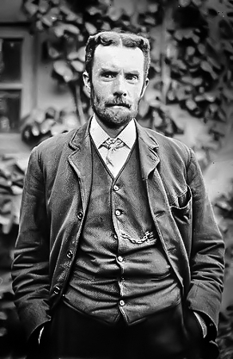
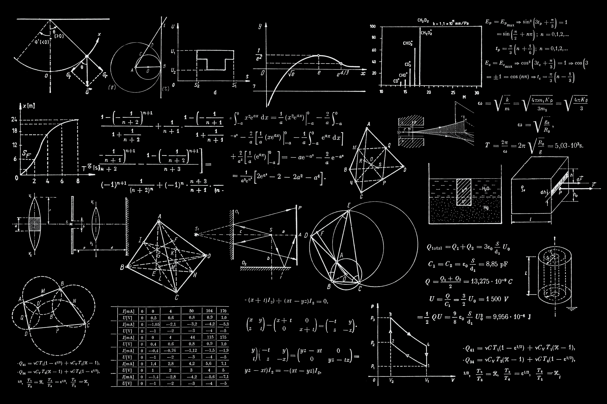

# Heaviside's Cover-Up Method

> $$ \texttt{Slides Made With Markdown and } \LaTeX$$

---

The cover up method was introduced by Oliver Heaviside as a fast way to do a decomposition into partial fractions. This is an essential step in usign the Laplpace transform to solve differential equations, and this was more or less Heaviside's original motivation.

> Inverse Laplace Transform
$$ f(t) = \frac{1}{2 \pi i}\int_{c - i\infty}^{c + i\infty } e^{st} F(s)ds $$

---

The cover up method can be used to make a partial fractions decomposition of a rational function $\frac{p(x)}{q(x)}$ whenever the denominator can be factored into distinct linear factors.

> Integral of a Rational Fraction:

$$ \int{\frac{2x^2 + 2x + 3}{(5x-7)^2(2x + 9)} dx}  $$

---

# Partial Fractions Decomposition

---

1. 
$$

\frac{2x^2 + 2x + 3}{(5x-7)^2(2x + 9)} = \frac{A}{(5x-7)} + \frac{B}{(5x-7)^2} + \frac{C}{(2x + 9)}

$$

2. 
$$

\left[\frac{2x^2 + 2x + 3}{(5x-7)^2(2x +9)} = \frac{A}{(5x-7)} + \frac{B}
{(5x-7)^2} + \frac{C}{(2x + 9)}\right] \left[ ( 5x - 7)^2 (2x + 9) \right]

$$

3.  
$$

2x^2 + 2x + 3 = A(5x - 7)(2x + 9) + B(2x - 9) + C(5x - 7)^2

$$

---

## Applying the Heavside Cover-Up

First of all, we can calculate the values for B and C using the Heavside Cover-Up method. The reason of this is that, in the partial fractions, the denominator of those values appear as factors in the denominator of original fraction on the left side of the equation. 

$$

\frac{2x^2 + 2x + 3}{(5x-7)^2 (2x + 9)} \Rightarrow \frac{B}{(5x-7)^2}  \& \frac{C}{(2x + 9)}  

$$

---

## Find the solution of each linear factor.

$For \rightarrow B$
$$

5x - 7 = 0 \Downarrow 

$$
$$

 
\boxed{x = \frac{7}{5} } 

$$

$For \rightarrow C$
$$

2x + 9 = 0 \Downarrow

$$
$$

\boxed{x = -\frac{9}{2} }

$$

---

After finding the solution of each linear factor, evaluate the expression on the right side of the equation and cancel the factor that becomes zero.

$\text{For B} \rightarrow \text{let x} = \frac{7}{5}$

$$

B = \frac{2x^2 + 2x + 3}{(5x-7)^2 (2x + 9)}\bigg|_{x=\frac{7}{5}}

$$

$$

B = \frac{2(\frac{7}{5})^2 + 2(\frac{7}{5}) + 3}{\cancelto{}{(5(\frac{7}{5})-7)^2} (2(\frac{7}{5}) + 9)}

$$

$$

B = \frac{2(\frac{7}{5})^2 + 2(\frac{7}{5}) + 3}{ (2(\frac{7}{5}) + 9)}

$$

$$
\boxed{B = \frac{243}{295}}

$$

---

$\text{For C} \rightarrow \text{let x} = -\frac{9}{2}$

$$

C = \frac{2x^2 + 2x + 3}{(5x-7)^2 (2x + 9)}\bigg|_{x=-\frac{9}{2}}

$$

$$

C = \frac{2(-\frac{9}{2})^2 + 2(-\frac{9}{2}) + 3}{(5(-\frac{9}{2})-7)^2 \cancelto{}{(2(-\frac{9}{2}) + 9)}}

$$

$$

C = \frac{2(-\frac{9}{2})^2 + 2(-\frac{9}{2}) + 3}{ (5(-\frac{9}{2})-7)^2}

$$

$$
\boxed{C = \frac{156}{3481}}

$$

